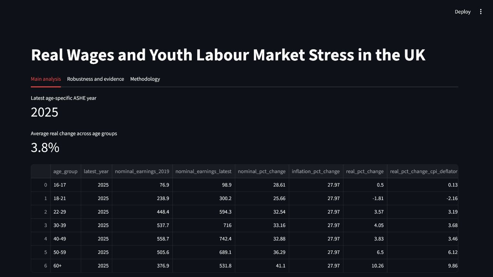

# Real Wages and Youth Labour Market Stress in the UK, 2019-2026

Reproducible Python and Streamlit project analysing UK real earnings and youth labour-market stress using official ONS data. It downloads and cleans inflation, ASHE earnings, AWE monthly pay, and labour-market datasets, then tests how sensitive young-worker real-wage conclusions are to deflator, baseline-year, earnings-measure, and worker-definition choices.



## Headline Finding

The 18-21 real earnings result is fragile and specification-dependent. The project does not support an over-simple claim that the youngest workers clearly became better or worse off after inflation since 2019.

The strongest conclusion is cautious: youngest-worker real wage outcomes are ambiguous under reasonable methodological choices, while the dashboard and evidence reports show which assumptions drive the result.

## What This Project Does

- Downloads and cleans official ONS datasets.
- Deflates nominal earnings using CPIH and CPI.
- Compares age groups and regions.
- Tracks youth unemployment and inactivity.
- Builds a Streamlit dashboard.
- Runs a robustness and evidence package.
- Produces source-value validation checks and final claim assessments.

## Reproduce The Project

Create and activate a virtual environment, then install dependencies:

```powershell
python -m venv .venv
.\.venv\Scripts\python -m pip install -r requirements.txt
.\.venv\Scripts\python -m pip install -e .
```

Run the full pipeline:

```powershell
make all
```

If `make` is not available on Windows, run the same steps directly:

```powershell
.\.venv\Scripts\python -m uk_wages.download
.\.venv\Scripts\python -m uk_wages.clean_cpi
.\.venv\Scripts\python -m uk_wages.clean_ashe
.\.venv\Scripts\python -m uk_wages.clean_region_ashe
.\.venv\Scripts\python -m uk_wages.clean_a05
.\.venv\Scripts\python -m uk_wages.clean_earn01
.\.venv\Scripts\python -m uk_wages.analysis
.\.venv\Scripts\python -m uk_wages.charts
.\.venv\Scripts\python -m uk_wages.robustness --run-all
.\.venv\Scripts\python -m uk_wages.source_validation
.\.venv\Scripts\python -m uk_wages.triangulation
.\.venv\Scripts\python -m uk_wages.final_claims
.\.venv\Scripts\python -m uk_wages.robustness --contrarian
.\.venv\Scripts\python -m uk_wages.evidence --build-report
.\.venv\Scripts\python -m pytest
```

Launch the dashboard:

```powershell
.\.venv\Scripts\python -m streamlit run dashboard/app.py
```

## Key Outputs

- Dashboard app: `dashboard/app.py`
- Charts: `outputs/charts`
- Final tables: `outputs/tables`
- Policy brief: `reports/policy_brief.md`
- Methodology: `reports/methodology.md`
- Reviewer guide: `REVIEWER_GUIDE.md`
- Release checklist: `RELEASE_CHECKLIST.md`
- Evidence report: `outputs/evidence/evidence_report.md`
- Final claims: `outputs/evidence/final_claims.md`
- Claim assessment: `outputs/evidence/claim_assessment.csv`
- Fragility diagnostics: `outputs/evidence/fragility_diagnostics.md`
- Source-value checks: `outputs/evidence/source_value_checks.csv`
- Manual validation audit: `outputs/evidence/manual_validation_audit.md`
- Triangulation report: `outputs/evidence/triangulation_report.md`

## Methodology And Limitations

Annual age-specific earnings use ASHE, so the age-specific wage analysis runs from 2019 to the latest available ASHE year. In the current source set, that is ASHE 2025 provisional. The project title includes 2019-2026 because inflation, EARN01, and A05 SA have current 2026 releases, but those are not 2026 age-specific ASHE wage results.

EARN01 provides current monthly whole-economy wage trends. It should not be interpreted as age-specific evidence. A05 SA provides youth labour-market stress context, not earnings evidence.

For the full methodology and reviewer path, see `reports/methodology.md` and `REVIEWER_GUIDE.md`.

## Portfolio Framing

GitHub description:

> Reproducible Python and Streamlit project analysing UK real earnings and youth labour-market stress using official ONS data, with a robustness harness testing deflator, baseline-year, earnings-measure, and worker-definition sensitivity.

CV bullet:

> Built a reproducible UK real wages and youth labour-market dashboard using ONS CPIH, ASHE, AWE, and labour-market data; added a robustness evidence harness testing deflator, baseline-year, earnings-measure, and worker-definition sensitivity, identifying fragile 18-21 results and generating policy-ready evidence reports.
