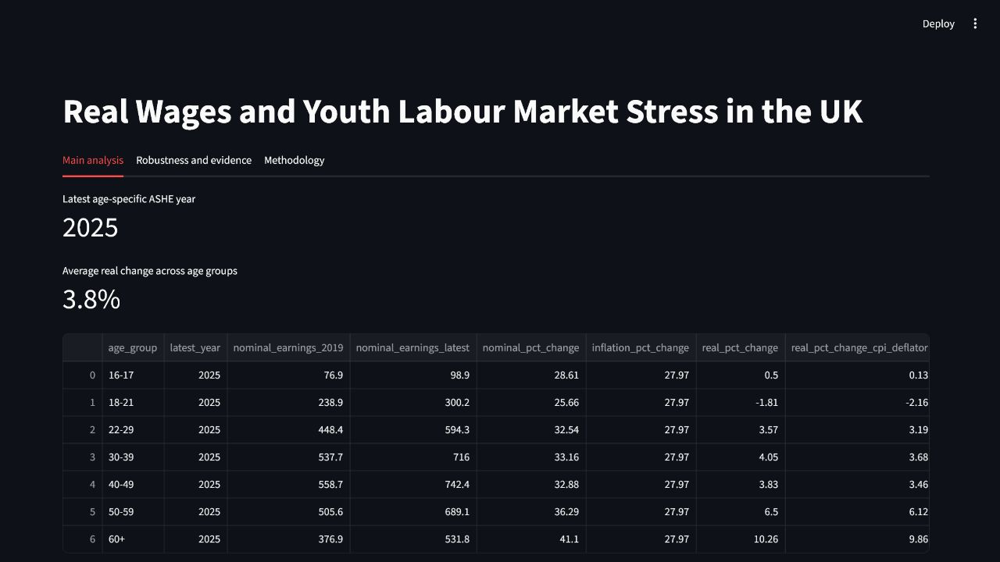

# Real Wages and Youth Labour Market Stress in the UK, 2019-2026

This repo asks whether published gross earnings for UK employee jobs, especially younger age groups, kept up with inflation since 2019. It rebuilds official source data and shows how the comparison changes with the deflator, start year, earnings measure, and work status. These are comparisons between age groups in successive surveys, rather than pay histories for the same people or a measure of household living standards.



## Main Finding

Baseline ASHE median weekly gross earnings for the 18-21 group fell 1.81% between April 2019 and April 2025 after April CPIH adjustment. The configured verdict is not robust: three of six core alternatives materially disagree. Those alternatives use a 2020 start, a 2021 start, or mean rather than median earnings. A separate full-time-only stress test gives a gain. Each changes the period, statistic, or population being compared; none establishes that the baseline arithmetic is wrong.

The 22-29 baseline gain is 3.57%, with one of six core alternatives materially disagreeing. RTI, A05, EARN01, ASHE hours, and minimum wage rates add context, but they do not replace ASHE. RTI is monthly PAYE age-pay evidence. A05 is labour-market status. EARN01 is monthly whole-economy pay, not age-specific pay. Minimum wage rates are policy context, not proof of cause.

The six checks are configured sensitivity comparisons, not independent statistical trials or probabilities that a claim is true. The stress tests that remove 2020 from the intervening path or restrict the displayed age groups leave the same 2019-to-2025 endpoint estimate for retained groups.

## Source Snapshot

The locked source set preserves the following editions. It is not a live October 2026 data feed.

| Source | Latest period in the saved release |
| --- | --- |
| ASHE age and region-age tables | April 2025, provisional; earlier years use revised editions |
| PAYE RTI, June 2026 release | May 2026 early estimate; April 2026 latest non-flash month |
| A05 SA, June 2026 release | February-April 2026; stored date is the rolling period's end |
| EARN01, June 2026 release | April 2026 |
| Minimum wage rates | Rates effective April 2026 |

## Earlier Research And Contribution

The broad question is established. Resolution Foundation's [Falling pay, divergent data and a bulging middle](https://www.resolutionfoundation.org/comment/falling-pay-divergent-data-and-a-bulging-middle/) (Cominetti, November 2023) examines real weekly pay since 2019 and the 18-21 group. Its [Narrowing the youth gap](https://www.resolutionfoundation.org/publications/narrowing-the-youth-gap/) (Murphy and Bukata, December 2023) discusses hourly pay, weekly pay, and working hours. The IFS report [What has happened to earnings since 2019?](https://ifs.org.uk/sites/default/files/2024-05/What-has-happened-to-earnings-IFS-Report_0.pdf) (Henry and Joyce, May 2024) compares ASHE, PAYE, AWE, and FRS.

This project is a replication and update exercise with inspectable source inputs, sensitivity comparisons, and a dashboard. It does not claim a new discovery or exact reproduction of every earlier figure: periods, source editions, populations, and deflators must match before numerical comparisons are meaningful.

An independent check on 5 October 2026 reproduced the November 2023 article's 18-21 result at its published precision. The original 2019 and 2023 provisional ASHE tables give median weekly gross pay of GBP 238.4 and GBP 270.4; April CPI is 107.6 and 130.4. `100 * ((270.4 / 238.4) * (107.6 / 130.4) - 1)` gives -6.4088%, rounding to the published -6.4%. The article's chart explicitly uses CPI. The matching provisional editions explain the number, but the article does not document its complete calculation workflow. With this repo's revised editions and CPIH, the 2019-to-2023 result is -3.67%; extending the endpoint to 2025 gives the saved -1.81%. See `reports/methodology.md` for the comparison.

## What The Pipeline Does

- Downloads ONS MM23, ASHE, PAYE RTI, A05 SA, EARN01, and GOV.UK minimum wage files into `data/raw`.
- Cleans raw files into long parquet tables under `data/processed`.
- Deflates ASHE earnings with CPIH by default and CPI as a sensitivity check.
- Builds age-group, region-age, RTI, ASHE decomposition, ASHE quality, ASHE composition, minimum wage, youth labour-market, monthly AWE, and Option B modelling outputs.
- Writes charts, triangulation metrics, ASHE approximate CV bands, source-value checks, fragility diagnostics, claim confidence, headline lineage, final claims, and a Streamlit dashboard.

## Rebuild It

Create the Python 3.12 environment used for release verification:

```powershell
py -3.12 -m venv .venv
.\.venv\Scripts\python -m pip install -r requirements.txt -c requirements.lock
.\.venv\Scripts\python -m pip install --no-build-isolation --no-deps -e .
```

Rebuild the saved release; the default full run uses the committed source lock:

```powershell
.\.venv\Scripts\python -m uk_wages.pipeline --all
```

If `make` is available on Windows, select the same interpreter explicitly:

```powershell
make PYTHON=./.venv/Scripts/python.exe all
```

For release reproduction against the committed source lockfile:

```powershell
.\.venv\Scripts\python -m uk_wages.pipeline --all --locked
```

The locked rebuild runs the full analysis, packages the evidence, and then runs the test suite. Its
reviewer-facing output is `releases/v2/evidence`. The package includes the source and
dependency lockfiles; raw workbooks, processed parquet files, and charts remain rebuild-only.

Run the same lint, type, and coverage gates used by CI:

```powershell
make PYTHON=./.venv/Scripts/python.exe quality
```

Without `make`, run:

```powershell
.\.venv\Scripts\python -m ruff check
.\.venv\Scripts\python -m mypy src
.\.venv\Scripts\python -m pytest --cov=uk_wages --cov-report=term-missing --cov-fail-under=55
```

To package already-generated v2 outputs without rerunning the pipeline:

```powershell
.\.venv\Scripts\python -m uk_wages.release_package
```

Launch the dashboard:

```powershell
.\.venv\Scripts\python -m streamlit run dashboard/app.py
```

## Files Worth Opening

- `dashboard/app.py` - Streamlit dashboard.
- `reports/research_note.md` - main written interpretation.
- `reports/policy_brief.md` - short summary only.
- `reports/methodology.md` - data choices and transformations.
- `docs/reviewer_guide.md` - suggested review path through the repo.
- `docs/v2_expansion_plan.md` - historical build plan and retained source-role guardrails.
- `config/sources.lock.yaml` - locked URLs, file hashes, release labels, download timestamps, and source file shapes for the release source set.
- `requirements.lock` - exact Python dependency constraints for the release environment.
- `releases/v2/evidence` - fixed reviewer package produced after a locked rebuild.
- `outputs/tables` - generated summary tables.
- `outputs/charts` - generated PNG charts.
- `outputs/evidence/source_value_checks.csv` - raw-to-processed spot checks.
- `outputs/evidence/final_claims.md` - qualified claim wording.
- `outputs/evidence/fragility_diagnostics.md` - why the 18-21 result is unstable.
- `outputs/evidence/triangulation_report.md` - age-preserving ASHE versus EARN01 direction and magnitude comparison.
- `outputs/evidence/rti_ashe_triangulation.md` - how RTI 18-24 compares with ASHE 18-21 and 22-29.
- `outputs/evidence/rti_ashe_annual_comparison.csv` - April-to-April RTI and ASHE annual overlap table.
- `outputs/evidence/ashe_decomposition_report.md` - hourly pay versus hours split and residual diagnostics.
- `outputs/tables/ashe_hours_decomposition_timeseries.csv` - year-by-year decomposition table.
- `outputs/evidence/ashe_quality_availability.md` - ASHE CV, quality, reliability, and suppression field audit.
- `outputs/evidence/ashe_uncertainty_bands.md` - approximate two-CV bands around 2019-to-latest ASHE changes.
- `outputs/evidence/option_b_ds_report.md` - structural-break relative weights, mixed-threshold minimum-wage event framing, and rough forecast-baseline diagnostics.
- `notebooks/option_b_walkthrough.ipynb` - notebook companion for Option B outputs.
- `outputs/evidence/ashe_composition_audit.md` - full-time, part-time, sex-split, hours, and job-count composition audit.
- `outputs/evidence/claim_confidence.md` - plain-English confidence labels for headline claims.
- `outputs/evidence/headline_number_lineage.csv` - source-to-claim map for headline numbers.
- `outputs/evidence/minimum_wage_context.md` - statutory wage-floor context.

Generated data and most outputs are ignored by git. Rebuild them with the commands above. The
reviewer-facing snapshot under `releases/v2/evidence` is committed for inspection without a
local rebuild.

ONS raw source files are not committed. `config/sources.lock.yaml` records the exact downloaded source files used for the release. `python -m uk_wages.download --locked` reuses hash-matching local files, restores bundled source snapshots where available, and otherwise downloads the locked URLs. Every payload must match its recorded SHA256 hash.

The ONS release lock uses dated ASHE editions and archived versions for CPI (`v129`), CPIH (`v130`), A05 (`v124`), EARN01 (`v128`), and RTI (`v86`). Workbook URLs containing `/current/previous/v.../` identify archived files. Their SHA256 hashes preserve the existing release data even when ONS publishes newer figures.

The GOV.UK minimum-wage Content API endpoint remains mutable. The original 5 September 2026 JSON is bundled as `config/source_snapshots/86f22b51304794243437296d78b6bc63cdc365b6fad1e820c57c6b55684b352d.json`. Locked runs restore these exact bytes and verify the existing hash, including with `--force`. On 5 October, the live JSON had changed only its timestamp and links; the page body and all rate-table cells matched the snapshot. Bundled snapshots use `<locked SHA256><file extension>` beside the source lock; a corrupt snapshot or hash mismatch fails verification without replacing cached data. Sources without snapshots still depend on publisher availability. Accepting new source bytes requires a reviewed source-lock update; `make data-refresh` remains the separate live download.

Refreshing sources is a separate maintenance operation. Downloading from the live source configuration does not by itself create a new verified release; review the editions and hashes, update the source lock, and rerun the analysis and quality gates before replacing the reviewer package.

## Checks After Rebuild

- `pytest` should pass.
- `outputs/evidence/source_value_checks.csv` should show 17 passing checks.
- `outputs/evidence/manual_validation_audit.md` should include independent direct-cell checks for RTI and GOV.UK minimum wage rates.
- RTI Jan 2019 indices should equal 100 where data exist.
- `outputs/evidence/final_claims.md` should keep the 18-21 result qualified.
- `outputs/evidence/ashe_quality_availability.md` should state whether ASHE CV fields were available.
- `outputs/evidence/ashe_uncertainty_bands.md` should describe approximate two-CV bands without calling them confidence intervals.
- `outputs/evidence/triangulation_summary.csv` and `outputs/evidence/rti_ashe_annual_summary.csv` should contain directional concordance metrics.
- `outputs/evidence/option_b_ds_report.md` should keep the modelling caveats clear.
- `outputs/evidence/claim_confidence.md` should keep the clear 18-21 gain/loss claim marked as unsupported or qualified.
- `outputs/evidence/headline_number_lineage.csv` should map each headline number to source files and validation checks.
- `outputs/charts` should contain generated PNG charts.
- `reports/policy_brief.md` should not describe the ASHE result as a 2026 age-specific wage finding.

## Boundaries

ASHE is an annual April reference-period survey of employee jobs. The main table uses the published all-sex, all-work-status row for each age group within ASHE's coverage and measures gross weekly earnings before deductions. It does not measure annual income, taxes, benefits, household costs, self-employment income, or the earnings of people outside employee jobs. CPIH is an aggregate price index, rather than a price index specific to young people.

The latest ASHE age-specific wage year in this source set is 2025 provisional. The project title includes 2026 because the saved monthly and policy sources extend into that year, but they do not provide 2026 age-specific ASHE wages.

RTI is PAYE administrative data. It covers payrolled employees, not self-employment or all income. It measures monthly pay, not ASHE weekly or hourly earnings. The latest RTI month is revision-prone.

Published ASHE CVs describe sampling precision. They do not establish that survey non-response or coverage bias is absent. [Forth and colleagues](https://openaccess.city.ac.uk/id/eprint/35689/) (online 2025; journal issue 2026) find underrepresentation of jobs in small, young private employers after official weighting. This pipeline does not estimate the effect of that bias on its age-specific changes. Passing source-value checks verifies selected transformations, rather than the representativeness of the underlying survey.

The hours comparison combines separate medians with an arithmetic residual. Published job-count ratios are composition proxies; the project does not calculate a composition-adjusted median or identify causes of wage or employment changes.

## CI

The default GitHub Actions workflow runs Ruff, mypy, and the test suite with the 55% coverage
floor on pushes and pull requests. The `Full pipeline evidence` workflow runs weekly and on
manual dispatch. It installs through `requirements.lock`, runs
`python -m uk_wages.pipeline --all --locked`, and uploads `releases/v2/evidence` as an artifact.
